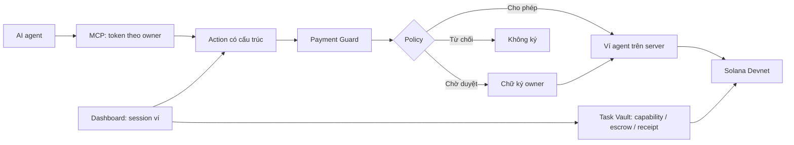

<p align="center">
  
</p>

<h1 align="center">nexusPay</h1>
<p align="center"><strong>AI thanh toán. Bạn giữ quyền kiểm soát.</strong><br />Payment Guard và Task Vault cho AI agent trên Solana Devnet.</p>
<p align="center">
  <a href="https://nexuspay-56wn.onrender.com">Thử demo</a> ·
  <a href="#chạy-local">Chạy local</a> ·
  <a href="docs/mcp-troubleshooting.md">Hướng dẫn MCP</a> ·
  <a href="#phạm-vi-và-giới-hạn">Phạm vi và giới hạn</a>
</p>

[](https://github.com/thanhhau15112000-dev/NexusWallet/actions/workflows/ci.yml)
[](LICENSE)

nexusPay cho phép AI agent đề xuất chuyển tiền, còn quy tắc do chủ ví đặt quyết định giao dịch được tự ký, cần duyệt hay bị chặn. Dự án là **demo Devnet**, chưa được audit bảo mật độc lập và chưa dành cho tài sản thật.

## Hai luồng thanh toán

| | Payment Guard | Task Capability Vault |
| --- | --- | --- |
| Mục đích | Chuyển SOL/SPL từ ví agent theo quy tắc | Cấp ngân sách SOL cho một nhiệm vụ |
| Nơi kiểm tra quyền | Backend: policy và chữ ký duyệt | Anchor program: capability, ngân sách, thời hạn, worker/service |
| Người giữ key | Server giữ key ví agent, mã hóa khi lưu | Owner cấp quyền; agent và worker ký các bước tương ứng |
| Kết quả | Giao dịch hoặc request chờ duyệt/từ chối | Escrow, receipt, settle hoặc refund |
| Ranh giới tin cậy | Cần tin runtime và dữ liệu của server | Cần tin program được triển khai và quyền nâng cấp; receipt không chứng minh chất lượng công việc |

Hai luồng có kiểm soát khác nhau. Policy của Payment Guard không phải hợp đồng on-chain, và Task Vault không biến ví agent thành ví non-custodial (owner tự giữ quyền kiểm soát key).

### Vì sao Solana

- **PDA (Program Derived Address):** mỗi task có capability PDA (`["capability", owner, task_id]`), vault PDA và escrow/receipt PDA. Program kiểm tra quyền trên các account này.
- **Signer theo vai trò:** owner cấp ngân sách/revoke, `agent_signer` tạo payment, worker ký settle. Quyền của từng vai trò được kiểm tra trong instruction.
- **SOL và SPL Token:** Payment Guard hỗ trợ cả hai; Task Vault hiện chỉ hỗ trợ SOL. Allowlist mint giới hạn loại SPL token được chuyển.
- **Rent và account lifecycle:** program đóng account ở các bước settle/refund/close tương ứng để hoàn rent. Escrow còn chờ phải được xử lý trước khi đóng task.
- **Permissionless refund:** sau expiry, caller bất kỳ có thể gửi instruction hoàn escrow về owner; không cần server nexusPay ký thay owner.

## Thử trong vài phút

1. Bật **Testnet Mode** trong Developer Settings của Phantom và chọn Solana Devnet.
2. Mở [dashboard](https://nexuspay-56wn.onrender.com), kết nối ví và ký tin nhắn đăng nhập. Bước này không chuyển tiền.
3. Lấy SOL thử nghiệm từ [Solana Faucet](https://faucet.solana.com), nạp cho ví agent hiển thị trên dashboard. Nút seed/airdrop có thể hết quỹ hoặc bị RPC giới hạn.
4. Đặt người nhận được phép, mức tối đa mỗi giao dịch và ngưỡng SOL trong 24 giờ ở tab Policy.
5. Kết nối MCP từ card hướng dẫn trên dashboard, hoặc dùng AI Commands để thử nhanh.

| Đề xuất của agent | Kết quả dự kiến |
| --- | --- |
| Người nhận được phép, trong hạn mức | `allow`: ví agent tự ký |
| Vượt mức mỗi giao dịch hoặc ngưỡng SOL 24 giờ | `require_approval`: chủ ví ký duyệt, hoặc hủy |
| Người nhận ngoài danh sách | `deny`: không có đường duyệt |
| Agent đang bị khóa | `AGENT_FROZEN`: chặn đường ký chuyển giá trị của server |

Ngưỡng 24 giờ là **ngưỡng yêu cầu duyệt**, không phải trần tuyệt đối: chủ ví có thể duyệt khoản vượt ngưỡng. Việc tính ngưỡng và chống retry hiện phụ thuộc lịch sử được giữ lại; xem [giới hạn lưu trữ](#phạm-vi-và-giới-hạn).

## Kiến trúc



- MCP gửi action trực tiếp; AI Commands chuyển prompt thành action qua model hoặc parser tất định. Model không nhận private key.
- Hosted mode tạo context riêng cho từng ví owner. MCP token chỉ gọi được các route trạng thái, request và đề xuất; không sửa policy, duyệt hoặc mở khóa.
- Chữ ký duyệt gắn với request, số tiền, người nhận, phiên bản policy, nonce và thời hạn. Thời hạn mặc định là 300 giây; session đăng nhập mặc định là 30 phút. Đăng nhập và duyệt giao dịch là hai thao tác khác nhau.
- Store JSON ghi qua file tạm rồi rename; audit payload mã hóa và có chuỗi hash. Đây là dữ liệu server, không phải sổ cái bất biến công khai.

### Đặc tính kỹ thuật

| Đặc tính | Triển khai và phạm vi |
| --- | --- |
| **Streamable HTTP / Bearer token** | Remote MCP tại `/mcp`, token theo owner; bản local có transport stdio |
| **ed25519** | Xác minh chữ ký `signMessage` của owner cho login và approval; approval gắn request, nonce, policy version và TTL |
| **AES-256-GCM** | Mã hóa private key và audit payload khi lưu (encryption at rest); không bảo vệ runtime đã bị chiếm quyền |
| **Append-only / SHA-256 hash chaining** | Audit ghi nối tiếp và liên kết hash giữa các entry; cần integrity verification, không phải log bất biến trước server có quyền sửa toàn bộ file |
| **Idempotency** | Với structured transfer action, `idempotencyKey` nhận diện retry cùng action; key khác action trả `IDEMPOTENCY_CONFLICT` khi record còn được giữ lại |
| **Retention / rolling 24-hour window** | Lịch sử mặc định giữ 200 request; phép tính chi SOL trong cửa sổ trượt 24 giờ hiện phụ thuộc lịch sử này |
| **Deterministic fallback parser** | AI Commands có parser tất định khi không dùng model provider; action vẫn qua schema validation và `evaluatePolicy` |
| **Multi-tenant / single-instance** | Context riêng theo owner; Store JSON và session hiện phục vụ một instance, chưa có transaction chung cho nhiều replica |

Nguồn: [`crypto.ts`](agent/src/crypto.ts), [`audit.ts`](agent/src/audit.ts), [`pipeline.ts`](agent/src/pipeline.ts), [`mcp-remote.ts`](agent/src/mcp-remote.ts), [`store.ts`](agent/src/store.ts).

### Cấu trúc repo

| Thư mục | Trách nhiệm |
| --- | --- |
| [`shared/src`](shared/src) | Schema action, đơn vị tiền, thông điệp duyệt, policy và state machine Task Vault |
| [`agent/src`](agent/src) | API, session/owner context, pipeline, signer, lưu trữ, audit và remote MCP |
| [`mcp/src`](mcp/src) | Công cụ MCP gọi API agent; không giữ key và không trực tiếp gọi chain |
| [`programs/nexus-task-vault`](programs/nexus-task-vault) | Anchor program kiểm tra quyền chi ngân sách nhiệm vụ |
| [`web/src`](web/src) | Dashboard React, tiếng Việt mặc định và lựa chọn tiếng Anh |
| [`extension`](extension) | Chrome extension mở dashboard |
| [`infra`](infra) | Docker và cấu hình triển khai |
| [`agent/test`](agent/test), [`mcp/test`](mcp/test) | Kiểm thử policy, approval, pipeline, routes, Task Vault và MCP |

Điểm vào chính: [`pipeline.ts`](agent/src/pipeline.ts), [`policy.ts`](shared/src/policy.ts), [`approvals.ts`](agent/src/approvals.ts), [`task-vault-chain.ts`](agent/src/task-vault-chain.ts). RPC cho chuyển SOL/SPL và RPC cho Task Vault nằm ở các module riêng.

## Kết nối MCP

Endpoint hosted: `https://nexuspay-56wn.onrender.com/mcp`. Đăng nhập dashboard rồi copy cấu hình theo client từ card MCP. Token là bí mật; không đưa vào issue, ảnh chụp hoặc repo.

| Tool | Chức năng |
| --- | --- |
| `nexuspay_get_status` | Ví agent, số dư, policy, mức SOL đã chi và trạng thái khóa |
| `nexuspay_list_requests` / `nexuspay_get_request` | Trạng thái đề xuất và link Explorer |
| `nexuspay_transfer_sol` / `nexuspay_transfer_spl` | Đề xuất chuyển tiền qua Payment Guard |

Nếu kết quả là `outcome_unknown`, đối chiếu request và Explorer; retry cùng action với **cùng** `idempotencyKey`. Hai key khác nhau được xem là hai đề xuất. Cơ chế này không bảo đảm chống gửi lại vô thời hạn khi record đã bị xóa khỏi lịch sử.

Local có bản stdio: `pnpm mcp:build`, sau đó `pnpm mcp:install -- --client codex|claude-desktop|antigravity`. Cấu hình và lỗi theo client: [MCP troubleshooting](docs/mcp-troubleshooting.md).

### Kịch bản demo Payment Guard

Đặt `Max per transaction = 0.1 SOL`, `Max per day = 0.2 SOL`, thêm recipient `my-wallet` vào allowlist và nạp đủ SOL Devnet kể cả phí mạng.

1. Gửi `0.05 SOL` đến `my-wallet`: `allow`, kiểm tra `execution.explorerUrl`.
2. Gửi `0.5 SOL` đến `my-wallet`: `require_approval`; owner ký duyệt trong TTL hoặc cancel.
3. Gửi đến recipient ngoài allowlist: `RECIPIENT_NOT_IN_ALLOWLIST`, không có đường approval.
4. Nếu bước 2 đã được duyệt, gửi thêm khoản nhỏ: `DAILY_LIMIT_EXCEEDED`, vì khoản đã duyệt cũng được tính vào rolling 24-hour window khi record còn lưu.
5. Bật kill switch rồi đề xuất transfer: `AGENT_FROZEN`. MCP không có tool tự unfreeze hoặc thay policy.

MCP trả `code`, `message`, `remediation` và `details` cho error/pending approval. `details` dùng SOL và lamports; pending request có `pollIntervalMs` và `dashboardUrl`. Ví dụ này kiểm tra hành vi trong retention hiện tại, không chứng minh chống retry hoặc daily cap vô thời hạn.

## Task Capability Vault

Program Devnet: [`3N4GYuQXvqhDeFKLWh4GiXdD3pr3PWcNRtkUyxSYPaUK`](https://explorer.solana.com/address/3N4GYuQXvqhDeFKLWh4GiXdD3pr3PWcNRtkUyxSYPaUK?cluster=devnet).

| Instruction | Quyền và tác dụng |
| --- | --- |
| `create_and_fund_task` | Owner tạo task, nạp ngân sách, đặt cap, expiry và worker/service |
| `execute_task_payment` | Agent signer tạo escrow trong phạm vi task |
| `settle_with_receipt` | Worker ký result hash và nhận khoản escrow |
| `revoke_task` | Owner chặn payment mới; không tự hủy escrow đã tạo |
| `refund_expired_escrow` | Sau expiry, bất kỳ caller nào cũng có thể hoàn escrow về owner |
| `refund_and_close` | Hoàn phần dư về owner và đóng task khi không còn escrow chờ; sau expiry/revoke không cần owner ký |
| `close_receipt` | Owner hoặc worker đóng receipt; rent về worker |

Demo nên đi theo thứ tự: tạo task → payment → settle → revoke → kiểm tra payment mới bị chặn → xử lý escrow còn lại → refund/close. Không revoke một task đã bị đóng. Worker có thể settle escrow đã tạo trước revoke nếu chưa hết hạn.

Receipt xác nhận **worker đã ký một result hash**, không xác minh chất lượng đầu ra. Mock worker trong demo nằm cùng hệ thống server, không phải bằng chứng về một dịch vụ độc lập.

## Bằng chứng và kiểm thử

```bash
pnpm test    # unit và integration; một số test cần local validator
pnpm build   # Vite bundle + TypeScript toàn workspace
```

| Bằng chứng | Phạm vi chứng minh | Giới hạn |
| --- | --- | --- |
| Local ngày 05/10/2026: 273 pass, 3 skip | Agent: 226 pass; MCP: 47 pass; các contract được test | Ba test on-chain skip khi thiếu local validator; không tính là pass |
| Build web và TypeScript qua | Code JS/TS biên dịch được | Không chứng minh program Rust hiện tại đã build/deploy |
| [Đợt Devnet 28/09, issue #6](https://github.com/thanhhau15112000-dev/NexusWallet/issues/6) | 28 chữ ký: 16 thành công, 12 bị từ chối; binary local khớp binary triển khai ở đợt đó | Bằng chứng lịch sử; không phải rebuild từ HEAD hiện tại hay QA toàn dashboard |
| [`policy.test.ts`](agent/test/policy.test.ts), [`approval.test.ts`](agent/test/approval.test.ts), [`pipeline.test.ts`](agent/test/pipeline.test.ts) | Policy, chữ ký sai/replay/hết hạn, model/action và pipeline | Không bao phủ mọi lỗi runtime hay mọi ngưỡng xóa lịch sử |
| Audit retention local ngày 05/10 | 10 khoản 0.1 SOL, rồi 200 request xem số dư: tổng ghi nhận từ 1 SOL về 0, verdict từ chờ duyệt thành cho phép; key cũ bị xóa | Tái hiện Store + Policy; không gửi tiền thật trên chain |

`pnpm e2e` là kiểm tra giao dịch Devnet khi agent đang chạy; cần ví có SOL thử nghiệm. `anchor build` và các test cần validator là bước riêng. Không suy ra trạng thái deployment từ CI xanh: kiểm tra `GET /api/health` và trường `commit`, rồi kiểm tra tính năng trên đúng bản đó.

## Phạm vi và giới hạn

Đã có Payment Guard cho SOL/SPL, allowlist người nhận/mint, approval, kill switch, remote MCP, context theo owner và Task Vault SOL. Chưa có mainnet, swap/staking/NFT, gọi program tùy ý, ngưỡng ngày cho SPL hoặc xác minh chất lượng công việc. Chưa có audit bảo mật độc lập.

| Giới hạn đã biết | Ảnh hưởng | Hướng khắc phục |
| --- | --- | --- |
| Retention mặc định giữ 200 request; spending ledger 24 giờ và idempotency record dùng cùng lịch sử ([Store](agent/src/store.ts), [Policy](shared/src/policy.ts)) | Request cũ bị prune (xóa khỏi lịch sử) có thể làm quên khoản chi trong 24 giờ và `idempotencyKey` | Tách spending ledger và idempotency record khỏi lịch sử hiển thị; bổ sung regression test cho pruning và restart. Tăng retention chỉ là giảm xác suất, không sửa invariant |
| Server giữ key ví agent | Mã hóa khi lưu không bảo vệ khỏi runtime bị chiếm quyền; owner không có đường rút trực tiếp độc lập server cho ví này | Giữ scope Devnet; nếu mở rộng, thiết kế quyền chi on-chain và đường thu hồi cho owner |
| Store/session phục vụ một instance | Nhiều replica không có đồng bộ/transaction chung | Giữ một instance; chỉ chuyển sang database giao dịch khi cần scale |
| Mất data hoặc passphrase | Có thể mất policy/token/key và khả năng truy cập tiền ví agent | Persistent disk, backup và kiểm thử restore; không coi tiền còn trên chain là bằng chứng vẫn rút được |
| MCP token baseline lưu plaintext | Người đọc được file có thể lấy token | PR [#79](https://github.com/thanhhau15112000-dev/NexusWallet/pull/79) đề xuất hash token; chưa tính là đã phát hành |
| Baseline chưa có rate limit và chưa giới hạn tổng seed | Spam gây quá tải hoặc hết quỹ SOL Devnet cấp phát | PR [#76](https://github.com/thanhhau15112000-dev/NexusWallet/pull/76), [#77](https://github.com/thanhhau15112000-dev/NexusWallet/pull/77); thêm WAF nếu cần |
| Audit log thuộc quyền kiểm soát server | Mã hóa/chuỗi hash không ngăn server có quyền sửa toàn bộ log hoặc cắt lịch sử | Kiểm tra integrity và lưu bản sao/checkpoint ngoài quyền kiểm soát server nếu cần bằng chứng độc lập |
| Task Vault vẫn có quyền nâng cấp | Luật triển khai có thể thay đổi; receipt không chứng minh công việc đúng | Công bố authority, phiên bản và source/binary mapping; quyết định quản trị nâng cấp trước mainnet |
| Record Task Vault và finalized chain chưa được đối chiếu đầy đủ | UI/API có thể chưa phản ánh trạng thái chain sau lỗi/khởi động lại | Theo dõi [#8](https://github.com/thanhhau15112000-dev/NexusWallet/issues/8), reconciliation theo finalized signature |
| Một số nội dung tiếng Việt còn tiếng Anh | Trải nghiệm đa ngôn ngữ chưa hoàn chỉnh | Theo dõi [#36](https://github.com/thanhhau15112000-dev/NexusWallet/issues/36), PR [#78](https://github.com/thanhhau15112000-dev/NexusWallet/pull/78) |

Bảng mô tả baseline đã merge của release UI và trạng thái PR tại ngày 05/10/2026. PR đang mở là hướng xử lý, không phải tính năng đã deploy.

## Chạy local

Yêu cầu Node 22+ và pnpm 10. Dùng file env mẫu cho **local**, không dùng secret mẫu khi hosted.

```bash
pnpm install --frozen-lockfile
cp .env.example .env
pnpm dev
```

PowerShell: thay `cp` bằng `Copy-Item .env.example .env`. API mặc định `http://127.0.0.1:8787`, dashboard `http://localhost:5173`.

Không đặt `GROQ_API_KEY` thì AI Commands dùng parser tất định; `MODEL_MODE=mock` buộc dùng parser. MCP agent bên ngoài tự lập kế hoạch, không cần Groq key của server. Local bind loopback; cấu hình RPC chỉ chấp nhận Devnet chính thức.

<details>
<summary><strong>Triển khai hosted và vận hành</strong></summary>

Docker phục vụ API, dashboard và `/mcp` cùng origin HTTPS. Cấu hình:

- `DEPLOYMENT_MODE=hosted`, `HOST=0.0.0.0`, `AGENT_DATA_DIR=/data`.
- `WEB_ORIGIN`: origin HTTPS, không có path hoặc dấu `/` cuối.
- `ADMIN_PUBKEY`: public key admin; `ALLOWED_OWNERS` để trống cho demo công khai, hoặc đặt danh sách owner được phép.
- `SESSION_COOKIE_SECRET`, `AGENT_KEYSTORE_PASSPHRASE`, `AUDIT_ENCRYPTION_PASSPHRASE`: ba secret riêng, ngẫu nhiên, tối thiểu 32 ký tự.

Chạy **một instance**, gắn persistent disk `/data`, cấu hình TLS tại hosting/reverse proxy và kiểm thử backup/restore. Mất disk/secret có thể làm mất khả năng truy cập ví agent; Task Vault có đường refund on-chain theo expiry và trạng thái escrow. Người gọi refund vẫn cần gửi giao dịch Solana và trả phí mạng.

Khi demo lỗi: kiểm tra mạng Phantom, số dư agent kể cả phí/rent, allowlist, trạng thái frozen, session và token. Request duyệt hết hạn phải tạo lại; không tự retry giao dịch có kết quả chưa rõ bằng key mới. Xem [troubleshooting](docs/mcp-troubleshooting.md).

</details>

## Hướng phát triển

Ưu tiên tiếp theo là sửa retention của spending ledger/idempotency, kiểm chứng restore và reconciliation Task Vault; sau đó hoàn tất hardening đang có PR và QA client/dashboard thực tế. Stablecoin và công cụ Task Vault qua MCP thuộc phạm vi mở rộng, không phải chức năng hiện tại.

Theo dõi: [roadmap #18](https://github.com/thanhhau15112000-dev/NexusWallet/issues/18), [hardening #75](https://github.com/thanhhau15112000-dev/NexusWallet/issues/75), [demo #66](https://github.com/thanhhau15112000-dev/NexusWallet/issues/66).

---

Giấy phép [MIT](LICENSE).
