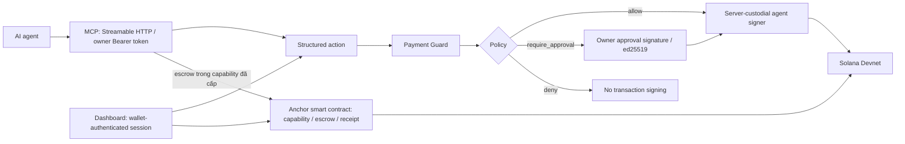

<p align="center">
  
</p>

<h1 align="center">nexusPay</h1>
<p align="center"><strong>AI thanh toán. Bạn giữ quyền kiểm soát.</strong><br />Payment Guard và Task Vault cho AI agent trên Solana Devnet.</p>
<p align="center">
  <a href="https://nexuspay-56wn.onrender.com">Thử demo</a> ·
  <a href="#chạy-local">Chạy local</a> ·
  <a href="docs/mcp-troubleshooting.md">Hướng dẫn MCP</a> ·
  <a href="#phạm-vi-và-giới-hạn">Phạm vi và giới hạn</a>
</p>

[](https://github.com/thanhhau15112000-dev/NexusWallet/actions/workflows/ci.yml)
[](LICENSE)

nexusPay cho phép AI agent đề xuất chuyển tiền, còn quy tắc do chủ ví đặt quyết định giao dịch được tự ký, cần duyệt hay bị chặn. Dự án là **demo Devnet**, chưa được audit bảo mật độc lập và chưa dành cho tài sản thật.

## Hai luồng thanh toán

| | Payment Guard | Task Capability Vault |
| --- | --- | --- |
| Mục đích | Chuyển SOL/SPL từ ví agent theo quy tắc | Cấp ngân sách SOL cho một nhiệm vụ |
| Authorization / policy enforcement | Backend: `evaluatePolicy` và owner approval signature | Anchor smart contract: capability, budget, expiry, worker/service allowlist |
| Key custody / signing authority | Server-custodial agent keypair, AES-256-GCM encryption at rest | Owner tạo capability; agent signer và worker signer có authority theo instruction |
| Kết quả | Giao dịch hoặc request chờ duyệt/từ chối | Escrow, receipt, settle hoặc refund |
| Trust boundary | Backend runtime, agent signer và persistent state | Deployed smart contract và upgrade authority; receipt không chứng minh chất lượng output |

Hai luồng có enforcement boundary khác nhau. Payment Guard là off-chain policy enforcement, không phải on-chain smart contract. Task Vault là Anchor smart contract với capability-based authorization; nó không thay đổi custody model của agent wallet thành non-custodial.

### Vì sao Solana

- **PDA (Program Derived Address):** mỗi task có capability PDA (`["capability", owner, task_id]`), vault PDA và escrow/receipt PDA. Program kiểm tra quyền trên các account này.
- **Signer authorization:** owner create/fund và revoke task, `agent_signer` execute payment, worker settle escrow. Smart contract kiểm tra signer constraint của từng instruction.
- **SOL và SPL Token:** Payment Guard hỗ trợ cả hai; Task Vault hiện chỉ hỗ trợ SOL. Allowlist mint giới hạn loại SPL token được chuyển.
- **Rent và account lifecycle:** program đóng account ở các bước settle/refund/close tương ứng để hoàn rent. Escrow còn chờ phải được xử lý trước khi đóng task.
- **Permissionless refund:** sau expiry, caller bất kỳ có thể gửi instruction hoàn escrow về owner; không cần server nexusPay ký thay owner.

## Thử trong vài phút

1. Bật **Testnet Mode** trong Developer Settings của Phantom và chọn Solana Devnet.
2. Mở [dashboard](https://nexuspay-56wn.onrender.com), kết nối ví và ký tin nhắn đăng nhập. Bước này không chuyển tiền.
3. Lấy SOL thử nghiệm từ [Solana Faucet](https://faucet.solana.com), nạp cho ví agent hiển thị trên dashboard. Nút seed/airdrop có thể hết quỹ, chạm giới hạn seed toàn server trong 24 giờ, bị rate limit theo IP hoặc bị RPC giới hạn.
4. Đặt người nhận được phép, mức tối đa mỗi giao dịch và ngưỡng SOL trong 24 giờ ở tab Policy.
5. Kết nối MCP từ card hướng dẫn trên dashboard, hoặc dùng AI Commands để thử nhanh.

| Đề xuất của agent | Kết quả dự kiến |
| --- | --- |
| Người nhận được phép, trong hạn mức | `allow`: ví agent tự ký |
| Vượt mức mỗi giao dịch hoặc ngưỡng SOL 24 giờ | `require_approval`: chủ ví ký duyệt, hoặc hủy |
| Người nhận ngoài danh sách | `deny`: không có đường duyệt |
| Agent đang bị khóa | `AGENT_FROZEN`: chặn đường ký chuyển giá trị của server |

Daily cap trong rolling 24-hour window là **approval threshold**, không phải hard cap: owner có thể approve transfer vượt ngưỡng. Pruning giữ SOL/SPL transfer đã hoặc có thể đã chuyển tiền trong 24 giờ, cùng request in-flight; idempotency không được bảo đảm vô thời hạn. Xem [phạm vi và giới hạn](#phạm-vi-và-giới-hạn).

## Kiến trúc



- MCP gửi action trực tiếp; AI Commands chuyển prompt thành action qua model hoặc deterministic parser. Model không nhận private key.
- Hosted mode tạo context riêng cho từng ví owner. MCP token chỉ gọi được 7 route: trạng thái, request, đề xuất transfer, đọc task và tạo escrow trong capability đã cấp; không sửa policy, duyệt, mở khóa, tạo/nạp/revoke/refund task hay settle.
- Owner approval signature bind request, amount, recipient, policy version, nonce và TTL. Approval TTL mặc định là 300 giây; authentication session TTL mặc định là 30 phút. Wallet authentication và transaction authorization là hai flow riêng.
- JSON Store persist qua temporary file + rename; audit payload dùng AES-256-GCM và SHA-256 hash chaining. Đây là server-side state, không phải immutable on-chain ledger.

### Đặc tính kỹ thuật

| Đặc tính | Triển khai và phạm vi |
| --- | --- |
| **Streamable HTTP / Bearer token** | Remote MCP tại `/mcp`, token theo owner; bản local có transport stdio. Hosted chỉ lưu `sha256(token)`, so khớp bằng `timingSafeEqual`, token chỉ hiển thị một lần khi tạo |
| **ed25519** | Signature verification cho owner `signMessage` trong authentication và approval; approval bind request, nonce, policy version và TTL |
| **AES-256-GCM** | Encryption at rest cho agent private key và audit payload; không bảo vệ khỏi runtime compromise |
| **Append-only / SHA-256 hash chaining** | Audit append entry và bind previous-entry hash; cần integrity verification, không cung cấp immutability trước server có quyền rewrite toàn bộ file |
| **Idempotency** | Với structured transfer action, `idempotencyKey` nhận diện retry cùng action; key khác action trả `IDEMPOTENCY_CONFLICT` khi record còn được giữ lại |
| **Retention / rolling 24-hour window** | Request retention mặc định là 200. Khi prune, giao dịch SOL/SPL đã hoặc có thể đã chuyển tiền trong 24 giờ và request chưa kết thúc được giữ lại, nên SOL spending accounting và idempotency key của chúng không mất trong cửa sổ 24 giờ ([store.test.ts](agent/test/store.test.ts)) |
| **Deterministic fallback parser** | AI Commands có deterministic parser khi không dùng model provider; action vẫn qua schema validation và `evaluatePolicy` |
| **Rate limit / seed cap** | Fixed-window limit theo route: đăng nhập 10/phút/IP, seed/airdrop 5/giờ/IP, đề xuất chuyển tiền và tạo escrow Task Vault dùng chung 30/phút/owner (bucket session và token MCP tách nhau), các route `/api` còn lại 240/phút/owner. Vượt giới hạn trả `RATE_LIMITED` kèm `retryAfterSeconds`. Seed từ master funder tối đa `SEED_CAP_PER_DAY` (mặc định 50) mỗi 24 giờ cho toàn server, giữ chỗ trước khi gửi giao dịch. Counter rate limit nằm trong memory, reset khi restart; không thay thế WAF/CDN |
| **Multi-tenant / single-instance** | Context riêng theo owner; Store JSON và session hiện phục vụ một instance, chưa có transaction chung cho nhiều replica |

Nguồn: [`crypto.ts`](agent/src/crypto.ts), [`audit.ts`](agent/src/audit.ts), [`pipeline.ts`](agent/src/pipeline.ts), [`mcp-remote.ts`](agent/src/mcp-remote.ts), [`store.ts`](agent/src/store.ts), [`rate-limit.ts`](agent/src/rate-limit.ts), [`seed-ledger.ts`](agent/src/seed-ledger.ts), [`mcp-token.ts`](agent/src/mcp-token.ts).

### Cấu trúc repo

| Thư mục | Trách nhiệm |
| --- | --- |
| [`shared/src`](shared/src) | Action schema, monetary units, approval message, policy và Task Vault state machine |
| [`agent/src`](agent/src) | API, session/owner context, pipeline, signer, lưu trữ, audit và remote MCP |
| [`mcp/src`](mcp/src) | Công cụ MCP gọi API agent; không giữ key và không trực tiếp gọi chain |
| [`programs/nexus-task-vault`](programs/nexus-task-vault) | Anchor smart contract: capability-based authorization, budget enforcement, escrow và receipt |
| [`web/src`](web/src) | Dashboard React, tiếng Việt mặc định (kể cả tab Docs) và lựa chọn tiếng Anh |
| [`extension`](extension) | Chrome extension mở dashboard |
| [`infra`](infra) | Docker và cấu hình triển khai |
| [`agent/test`](agent/test), [`mcp/test`](mcp/test) | Kiểm thử policy, approval, pipeline, routes, Task Vault và MCP |

Điểm vào chính: [`pipeline.ts`](agent/src/pipeline.ts), [`policy.ts`](shared/src/policy.ts), [`approvals.ts`](agent/src/approvals.ts), [`task-vault-chain.ts`](agent/src/task-vault-chain.ts). RPC cho chuyển SOL/SPL và RPC cho Task Vault nằm ở các module riêng.

## Kết nối MCP

Endpoint hosted: `https://nexuspay-56wn.onrender.com/mcp`. Đăng nhập dashboard rồi copy cấu hình theo client từ card MCP. Token là bí mật và chỉ hiển thị một lần khi tạo (server lưu hash); mất token thì tạo token mới. Không đưa vào issue, ảnh chụp hoặc repo.

| Tool | Chức năng |
| --- | --- |
| `nexuspay_get_status` | Ví agent, số dư, policy, mức SOL đã chi và trạng thái khóa |
| `nexuspay_list_requests` / `nexuspay_get_request` | Trạng thái đề xuất và link Explorer |
| `nexuspay_transfer_sol` / `nexuspay_transfer_spl` | Đề xuất chuyển tiền qua Payment Guard |
| `nexuspay_list_tasks` / `nexuspay_get_task` | Capability, ngân sách còn lại, cap, expiry, worker/service; chi tiết có escrow và receipt. Đọc record local, chưa đối chiếu lại chain |
| `nexuspay_execute_task_payment` | Tạo escrow trong capability owner đã cấp; worker ký receipt để nhận tiền ở bước riêng |

Nếu kết quả là `outcome_unknown`, đối chiếu request và Explorer; retry cùng action với **cùng** `idempotencyKey`. Hai key khác nhau được xem là hai đề xuất. Nếu nhận `RATE_LIMITED`, chờ `retryAfterSeconds` rồi retry với cùng key, không đổi số tiền. Cơ chế này không bảo đảm idempotency vô thời hạn khi request record đã bị prune.

**Task Vault qua MCP:** owner tạo và nạp task trên dashboard; agent gọi `nexuspay_list_tasks` rồi `nexuspay_get_task` để đọc quyền đã cấp. Tạo escrow bằng `nexuspay_execute_task_payment` với `taskId`, `paymentId`, địa chỉ `worker`, `serviceId`, `amountLamports` (số nguyên; 1 SOL = 1.000.000.000 lamports) và `requestHash` (SHA-256 hex thường, 64 ký tự). MCP không tạo/nạp task, đổi quyền, revoke, chạy mock worker, settle hay refund.

Mỗi khoản dùng một `paymentId` riêng trong task. Retry khoản đã có record với cùng tham số trả record đó và `reused: true`; đổi tham số trả `IDEMPOTENCY_CONFLICT`. Nếu nhận `outcome_unknown`, đọc lại task và **giữ nguyên paymentId cùng tham số**. Nếu vẫn thiếu record, owner cần đối chiếu escrow Devnet trước khi bắt đầu khoản khác; đường này chưa tự khôi phục record khi chain đã nhận giao dịch nhưng API mất kết quả. Trường `mode: simulated` chỉ là mô phỏng, không chuyển SOL. Bản Devnet hiện chỉ hỗ trợ mock worker do server giữ key; receipt không chứng minh chất lượng công việc.

Kiểm tra owner, agent signer hiện tại và task chưa đóng áp dụng cho cả simulated lẫn Devnet; đây là chủ ý để mô phỏng không bỏ qua quyền được cấp. Record simulated lệch signer (ví dụ sau khi thay ví agent) bị từ chối; cần tạo task simulated mới. MCP không tự sửa signer trên task cũ.

Lỗi đọc task trước bước POST không được báo `outcome_unknown`. Sau khi bắt đầu POST, lỗi mạng/5xx vẫn được xử lý thận trọng: API hiện trả cùng `onchain_payment_failed` cho lỗi trước khi gửi và lỗi chưa rõ xác nhận, nên chưa phân loại được hai trường hợp đó. Khi ghi record, cập nhật spent và payment vẫn là hai lần ghi riêng; chưa có khôi phục tự động nếu lần ghi sau thất bại.

Task payment và transfer intent dùng chung trần 30 yêu cầu/phút theo loại danh tính và owner đã xác thực; đổi task hoặc route không tạo quota mới. Session dashboard và token MCP có bucket riêng, nên đây không phải trần chung 30 yêu cầu/phút cho mọi cách truy cập của một owner.

Local có bản stdio: `pnpm mcp:build`, sau đó `pnpm mcp:install -- --client codex|claude-desktop|antigravity`. Cấu hình và lỗi theo client: [MCP troubleshooting](docs/mcp-troubleshooting.md).

### Kịch bản demo Payment Guard

Đặt `Max per transaction = 0.1 SOL`, `Max per day = 0.2 SOL`, thêm recipient `my-wallet` vào allowlist và nạp đủ SOL Devnet kể cả phí mạng.

1. Gửi `0.05 SOL` đến `my-wallet`: `allow`, kiểm tra `execution.explorerUrl`.
2. Gửi `0.5 SOL` đến `my-wallet`: `require_approval`; owner ký duyệt trong TTL hoặc cancel.
3. Gửi đến recipient ngoài allowlist: `RECIPIENT_NOT_IN_ALLOWLIST`, không có đường approval.
4. Nếu bước 2 đã được duyệt, gửi thêm khoản nhỏ: `DAILY_LIMIT_EXCEEDED`, vì khoản đã duyệt cũng được tính vào rolling 24-hour window; pruning bảo vệ record cần cho cửa sổ này.
5. Bật kill switch rồi đề xuất transfer: `AGENT_FROZEN`. MCP không có tool tự unfreeze hoặc thay policy.

MCP trả `code`, `message`, `remediation` và `details` cho error/pending approval. `details` dùng SOL và lamports; pending request có `pollIntervalMs` và `dashboardUrl`. Ví dụ này kiểm tra hành vi trong retention hiện tại, không chứng minh idempotency hoặc daily cap enforcement ngoài retention window.

## Task Capability Vault

Program Devnet: [`3N4GYuQXvqhDeFKLWh4GiXdD3pr3PWcNRtkUyxSYPaUK`](https://explorer.solana.com/address/3N4GYuQXvqhDeFKLWh4GiXdD3pr3PWcNRtkUyxSYPaUK?cluster=devnet).

| Instruction | Signer authorization và state transition |
| --- | --- |
| `create_and_fund_task` | Owner tạo capability PDA + vault PDA, fund `budget`, đặt `per_payment_cap`, `expiry` và worker/service allowlist |
| `execute_task_payment` | `agent_signer` tạo escrow PDA; enforce budget, per-payment cap, expiry và worker/service allowlist |
| `settle_with_receipt` | Worker signer submit `result_hash`, settle escrow và tạo receipt PDA bind `request_hash` từ escrow |
| `revoke_task` | Owner revoke capability; reject payment mới, không cancel held escrow |
| `refund_expired_escrow` | Sau expiry, bất kỳ caller nào cũng có thể hoàn escrow về owner |
| `refund_and_close` | Hoàn phần dư về owner và đóng task khi không còn escrow chờ; sau expiry/revoke không cần owner ký |
| `close_receipt` | Owner hoặc worker đóng receipt; rent về worker |

Demo nên đi theo thứ tự: tạo task → payment → settle → revoke → kiểm tra payment mới bị chặn → xử lý escrow còn lại → refund/close. Không revoke một task đã bị đóng. Worker có thể settle escrow đã tạo trước revoke nếu chưa hết hạn.

Receipt là **worker-signed attestation với `result_hash`**, không phải proof of correctness hoặc proof of service quality. Mock worker trong demo nằm cùng hệ thống server, không phải bằng chứng về một dịch vụ độc lập.

## Bằng chứng và kiểm thử

```bash
pnpm test    # unit và integration; một số test cần local validator
pnpm build   # Vite bundle + TypeScript toàn workspace
```

| Bằng chứng | Phạm vi chứng minh | Giới hạn |
| --- | --- | --- |
| Local ngày 08/10/2026 trên nhánh release #76–#79: 323 pass, 3 skip | `pnpm test`: agent 275 pass; MCP 48 pass | Ba test on-chain skip khi thiếu local validator; không tính là pass |
| Build web và TypeScript qua | Code JS/TS biên dịch được | Không chứng minh program Rust hiện tại đã build/deploy |
| [Đợt Devnet 28/09, issue #6](https://github.com/thanhhau15112000-dev/NexusWallet/issues/6) | 28 chữ ký: 16 thành công, 12 bị từ chối; binary local khớp binary triển khai ở đợt đó | Bằng chứng lịch sử; không phải rebuild từ HEAD hiện tại hay QA toàn dashboard |
| [`policy.test.ts`](agent/test/policy.test.ts), [`approval.test.ts`](agent/test/approval.test.ts), [`pipeline.test.ts`](agent/test/pipeline.test.ts) | Policy, chữ ký sai/replay/hết hạn, model/action và pipeline | Không bao phủ mọi lỗi runtime hay mọi ngưỡng xóa lịch sử |
| Regression retention sau fix [#85](https://github.com/thanhhau15112000-dev/NexusWallet/pull/85) | 10 × 0.1 SOL rồi 200 balance requests: spending vẫn 1 SOL, transfer tiếp theo vẫn `require_approval`. Key SOL/SPL `confirmed` và `failed/execution_failed` tồn tại cả sau restart Store | CONTRACT-TEST VERIFIED và REPRODUCED LOCAL; không gửi tiền trên chain, chưa E2E hosted riêng cho fix |
| Release hotfix [#86](https://github.com/thanhhau15112000-dev/NexusWallet/pull/86), ngày 05/10/2026 | Fix #85 đã vào `main`; `/api/health` của demo trả commit `f8639818bf7a53839089bcf3d87ae77621b41d06`, khớp release source | DEPLOYMENT VERIFIED qua commit; health không chứng minh toàn bộ chức năng hoặc on-chain E2E |
| Release [#88](https://github.com/thanhhau15112000-dev/NexusWallet/pull/88), ngày 08/10/2026 | PR #76–#79 đã vào `main`; `/api/health` trả commit `7a24005e72610050d6d5fcd9d0be1f7542d91522` | DEPLOYMENT VERIFIED qua commit; rate limit chưa load-test trên hosted |

`pnpm e2e` là kiểm tra giao dịch Devnet khi agent đang chạy; cần ví có SOL thử nghiệm. `anchor build` và các test cần validator là bước riêng. Không suy ra trạng thái deployment từ CI xanh: kiểm tra `GET /api/health` và trường `commit`, rồi kiểm tra tính năng trên đúng bản đó.

## Phạm vi và giới hạn

Đã có Payment Guard cho SOL/SPL, allowlist người nhận/mint, approval, kill switch, remote MCP, context theo owner và Task Vault SOL. Chưa có mainnet, swap/staking/NFT, gọi program tùy ý, ngưỡng ngày cho SPL hoặc xác minh chất lượng công việc. Chưa có audit bảo mật độc lập.

Bảng xếp theo **potential impact từ cao xuống thấp**: quyền ký và tài sản, policy bypass, mất khả năng recovery, availability, rồi audit/UX. Thứ tự này không đồng nghĩa mọi threat đã được khai thác hoặc có cùng likelihood. Scope hiện tại là Devnet; chưa có bằng chứng mất tài sản mainnet. Rủi ro trust model và BUG đã tái hiện được phân biệt trong cột bằng chứng.

| Thứ tự / threat hoặc giới hạn | Điều kiện và impact | Classification / evidence | Hướng khắc phục |
| --- | --- | --- | --- |
| **1. Server-custodial signing / runtime compromise** | Nếu attacker chiếm agent process hoặc lấy keystore kèm passphrase, có thể sử dụng agent private key ngoài `evaluatePolicy`, approval và kill switch. Process giữ signer của các tenant đang load, master funder và mock worker: blast radius có thể vượt một owner. Với Task Vault, agent signer vẫn bị ràng buộc bởi smart contract hiện hành | **INTENTIONAL custody model; SOURCE ONLY**, confidence cao về key custody ([context](agent/src/context.ts), [crypto](agent/src/crypto.ts)); chưa tái hiện compromise | Giữ Devnet scope; nếu chuyển sang tài sản thật, thiết kế on-chain spending authority và owner recovery, isolate signer/trust domain. AES-256-GCM encryption at rest không thay thế runtime isolation |
| **2. Smart contract upgrade authority** | Nếu upgrade authority còn active và bị compromise/lạm dụng, program có thể bị thay thế; budget/allowlist/refund invariant và tài sản trong Task Vault phụ thuộc code mới | **NEEDS DECISION; bằng chứng Devnet lịch sử 28/09** tại [#6](https://github.com/thanhhau15112000-dev/NexusWallet/issues/6). Confidence trung về trạng thái authority hiện tại: chưa refresh on-chain trong audit này; không có bằng chứng khai thác | Công bố authority và source/binary mapping; quyết định multisig/timelock hoặc revoke upgrade authority sau khi xác minh program và recovery contract |
| **3. MCP Bearer token bị lộ** | Token bị lộ thì attacker có thể impersonate MCP client của owner, đọc request và task, submit transfer qua policy và tạo escrow trong budget Task Vault owner đã cấp (trong cap, expiry, worker/service của task). Không có quyền đổi policy/approve/unfreeze, settle hay refund qua MCP token | **MITIGATED một phần; CONTRACT-TEST VERIFIED**: hosted lưu hash token at rest và chỉ hiển thị token một lần ([mcp-token](agent/src/mcp-token.ts), PR [#79](https://github.com/thanhhau15112000-dev/NexusWallet/pull/79)); file plaintext bản cũ được ghi lại thành hash ở lần đọc đầu | Hash storage không ngăn dùng một valid token đã bị đánh cắp: rotate khi lộ, không đưa token vào ảnh chụp/repo |
| **4. SPL chỉ có per-transaction cap** | Agent/token holder có thể submit nhiều transfer hợp lệ dưới cap tới recipient/mint allowlisted và tiêu hết SPL balance mà không chạm aggregate daily cap. Đây là thiếu aggregate budget enforcement, không phải bypass SOL daily cap | **INTENTIONAL scope limitation; SOURCE ONLY**, confidence cao ([policy](shared/src/policy.ts)); chưa thực hiện chuỗi SPL transfer trên chain | Cần quyết định per-mint rolling-window budget hoặc task budget trước khi claim kiểm soát tổng chi SPL |
| **5. Keystore/state recovery** | Mất keystore hoặc passphrase và không có backup khiến owner có thể mất khả năng truy cập tài sản agent wallet. Mất Store có thể reset policy, spending accounting và idempotency. Tài sản còn trên chain không bảo đảm key recovery | **NEEDS DECISION recovery contract; SOURCE ONLY**, confidence cao về storage dependency; chưa chạy disaster-recovery test ([crypto](agent/src/crypto.ts), [Store](agent/src/store.ts)) | Persistent storage, encrypted backup, secret recovery policy và restore drill; thiết kế owner recovery độc lập server. Đây là storage/key-management risk, không phải hạn chế riêng của hosting provider |
| **6. Request flooding / Sybil seed depletion** | Flooding có thể làm tăng RPC/disk/CPU load và gián đoạn login/transfer; nhiều owner claim seed có thể làm cạn master funder SOL Devnet | **MITIGATED ở tầng ứng dụng; CONTRACT-TEST VERIFIED**: fixed-window rate limit theo IP/owner cho route nhạy cảm, trả `RATE_LIMITED` kèm `retryAfterSeconds` ([rate-limit](agent/src/rate-limit.ts), PR [#76](https://github.com/thanhhau15112000-dev/NexusWallet/pull/76)); tổng seed tối đa `SEED_CAP_PER_DAY` (mặc định 50) mỗi 24 giờ ([seed-ledger](agent/src/seed-ledger.ts), PR [#77](https://github.com/thanhhau15112000-dev/NexusWallet/pull/77)). Chưa load-test trên hosted | Counter nằm trong memory một process, reset khi restart; không có CDN/WAF nên không hấp thụ flood tầng mạng (DDoS/botnet). Cần WAF/CDN hoặc owner allowlist nếu mở rộng |
| **7. Worker attestation không xác minh output; revoke không cancel held escrow** | Worker được cấp quyền có thể submit nonzero `result_hash` để settle mà không có verifier chất lượng. Held escrow vẫn settleable sau revoke đến expiry; owner không claw back khoản đã commit trước expiry. Hiểu revoke như refund tức thời có thể dẫn tới cấp quyền sai kỳ vọng | **INTENTIONAL settlement contract; SOURCE ONLY**, confidence cao ([settle](programs/nexus-task-vault/src/instructions/settle_with_receipt.rs), [refund](programs/nexus-task-vault/src/instructions/refund_and_close.rs)); chất lượng dịch vụ ngoài chain chưa được chứng minh | Công bố escrow commitment semantics; nếu cần proof of service, chốt verifier/dispute/acceptance contract trước khi bổ sung. Mock worker cùng backend không phải independent verifier |
| **8. Single-instance Store / finalized reconciliation** | Multi-replica không có shared transactional state có thể làm diverge spending accounting, request và idempotency. Sau RPC timeout/crash, Task Vault record có thể chưa khớp finalized chain; nguy cơ UI báo sai trạng thái, retry/refund sai kỳ vọng | **NEEDS DECISION scale/reconciliation; SOURCE ONLY**; [#8](https://github.com/thanhhau15112000-dev/NexusWallet/issues/8) đã track reconciliation. Confidence trung về runtime impact; chưa tái hiện multi-replica hoặc đầy đủ crash matrix | Giữ single-instance deployment; durable transaction boundary khi scale; reconcile theo finalized signature/PDA trước khi retry hoặc cập nhật record |
| **9. Audit integrity nằm cùng trust domain** | Actor có quyền rewrite/truncate audit file có thể che lịch sử; AES-256-GCM và SHA-256 hash chaining không cung cấp external anchoring. Thiếu checkpoint độc lập làm giảm khả năng điều tra khi server compromise | **INTENTIONAL server-side log; SOURCE ONLY**, confidence cao ([audit](agent/src/audit.ts)); chưa chứng minh log bị sửa trên hosted | Integrity verification, off-host append-only sink hoặc signed/anchored checkpoint; không claim tamper-proof hoặc immutable ledger |
| **10. Localization** | String tiếng Việt còn sót làm UX không nhất quán; không gây authorization bypass | **MITIGATED; CONTRACT-TEST VERIFIED** cho tab Docs và nhãn request (PR [#78](https://github.com/thanhhau15112000-dev/NexusWallet/pull/78), [#36](https://github.com/thanhhau15112000-dev/NexusWallet/issues/36)); test parity en/vi | Chưa QA thủ công toàn bộ error/approval states bằng tiếng Việt |

**Retention còn lại sau fix:** SOL/SPL transfer đã hoặc có thể đã chuyển tiền được bảo vệ trong rolling 24-hour window theo `createdAt`; request in-flight được giữ đến khi kết thúc. Transfer cũ hơn cửa sổ này, denied và balance requests vẫn có thể bị prune cùng key. Tập được bảo vệ có thể vượt `MAX_REQUESTS_KEPT`; nếu bỏ daily SOL threshold thì số transfer có thể tăng theo số dư và lượng nạp, còn pending approvals chỉ được expire khi đọc request. Đây là giới hạn storage/retention đã công bố, không phải lỗi mất ledger trong 24 giờ đã sửa. Hướng dài hạn là durable spending/idempotency ledger tách khỏi UI history; cần đo storage và kiểm chứng cleanup trước khi tăng tải.

Audit baseline ban đầu: `9e58e8d`. Snapshot release cập nhật ngày 05/10/2026: `main` và demo tại `f8639818bf7a53839089bcf3d87ae77621b41d06`. Lỗi request pruning P2 đã được sửa trong #85 và release qua #86; không còn là BUG đang mở của bản này. Fix không khôi phục request/key đã bị prune ở bản cũ. PR #76–#79 release lên `main` ngày 08/10/2026; trạng thái deploy kiểm tra qua trường `commit` của `GET /api/health`. Audit này không phải penetration test, runtime compromise test, load test hoặc refresh toàn bộ program state on-chain.

## Chạy local

Yêu cầu Node 22+ và pnpm 10. Dùng file env mẫu cho **local**, không dùng secret mẫu khi hosted.

```bash
pnpm install --frozen-lockfile
cp .env.example .env
pnpm dev
```

PowerShell: thay `cp` bằng `Copy-Item .env.example .env`. API mặc định `http://127.0.0.1:8787`, dashboard `http://localhost:5173`.

Không đặt `GROQ_API_KEY` thì AI Commands dùng deterministic parser; `MODEL_MODE=mock` buộc dùng parser. MCP agent bên ngoài tự lập kế hoạch, không cần Groq key của server. Local bind loopback; cấu hình RPC chỉ chấp nhận Devnet chính thức.

<details>
<summary><strong>Triển khai hosted và vận hành</strong></summary>

Docker phục vụ API, dashboard và `/mcp` cùng origin HTTPS. Cấu hình:

- `DEPLOYMENT_MODE=hosted`, `HOST=0.0.0.0`, `AGENT_DATA_DIR=/data`.
- `WEB_ORIGIN`: origin HTTPS, không có path hoặc dấu `/` cuối.
- `ADMIN_PUBKEY`: public key admin; `ALLOWED_OWNERS` để trống cho demo công khai, hoặc đặt danh sách owner được phép.
- `SESSION_COOKIE_SECRET`, `AGENT_KEYSTORE_PASSPHRASE`, `AUDIT_ENCRYPTION_PASSPHRASE`: ba secret riêng, ngẫu nhiên, tối thiểu 32 ký tự.

Chạy **một instance**, gắn persistent disk `/data`, cấu hình TLS tại hosting/reverse proxy và kiểm thử backup/restore. Mất disk/secret có thể làm mất khả năng truy cập ví agent; Task Vault có đường refund on-chain theo expiry và trạng thái escrow. Người gọi refund vẫn cần gửi giao dịch Solana và trả phí mạng.

Khi demo lỗi: kiểm tra mạng Phantom, số dư agent kể cả phí/rent, allowlist, trạng thái frozen, session và token. Request duyệt hết hạn phải tạo lại; không tự retry giao dịch có kết quả chưa rõ bằng key mới. Xem [troubleshooting](docs/mcp-troubleshooting.md).

</details>

## Hướng phát triển

Ưu tiên tiếp theo là kiểm chứng restore và reconciliation Task Vault; sau đó load-test hosted, WAF/CDN và QA client/dashboard thực tế. Stablecoin thuộc phạm vi mở rộng, không phải chức năng hiện tại.

Theo dõi: [roadmap #18](https://github.com/thanhhau15112000-dev/NexusWallet/issues/18), [hardening #75](https://github.com/thanhhau15112000-dev/NexusWallet/issues/75), [demo #66](https://github.com/thanhhau15112000-dev/NexusWallet/issues/66).

---

Giấy phép [MIT](LICENSE).
